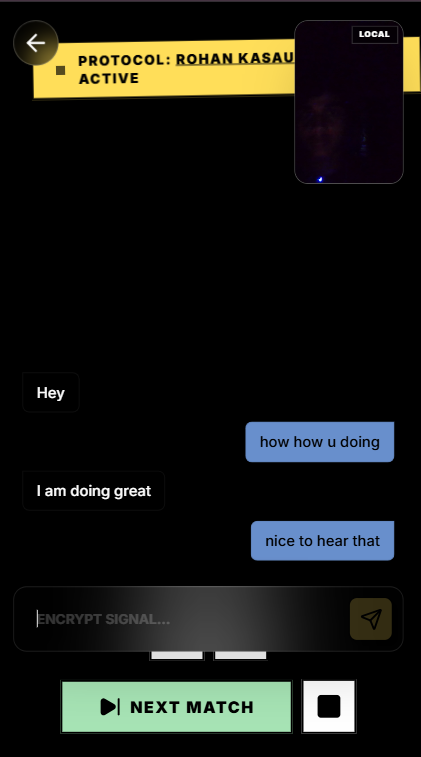
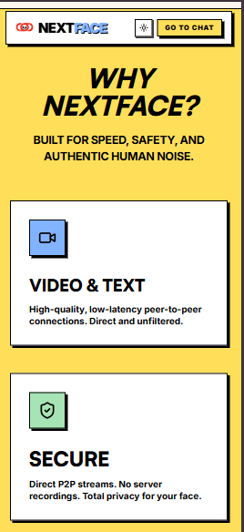
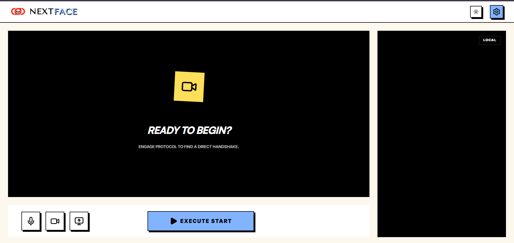
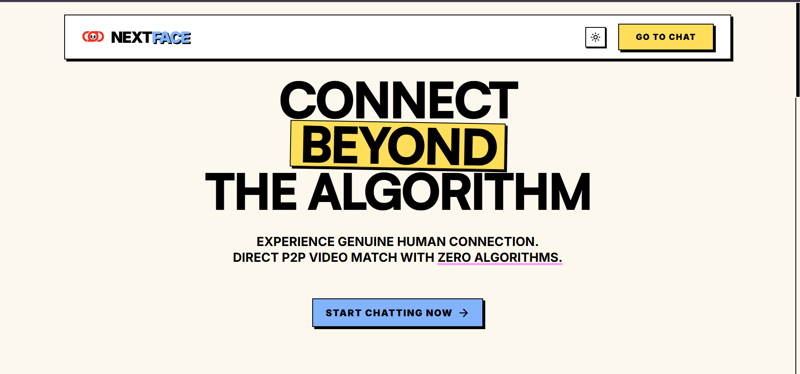
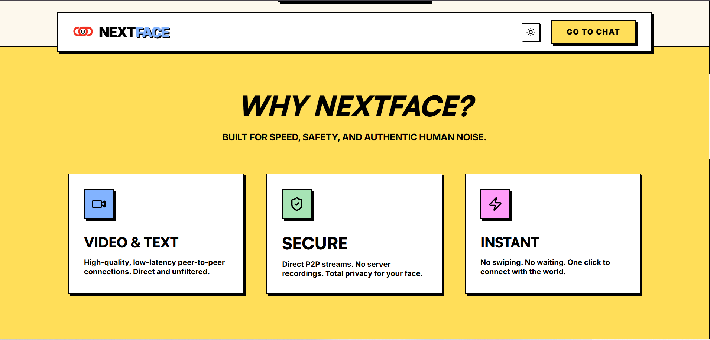

<div align="center">
  <h1>🌐 NextFace</h1>
  <p><strong>A massively scalable, 100% serverless Omegle alternative built on the Edge.</strong></p>
</div>

<br />

NextFace is a modern, real-time random video chat application engineered to operate with **zero server costs**. By entirely bypassing traditional Node.js/WebSocket backends and relying on Edge-based matchmaking and Peer-to-Peer connections, NextFace can scale to thousands of concurrent users for free.

  

## 🚀 Architecture & Tech Stack

NextFace utilizes a bleeding-edge serverless architecture:

- **Frontend Environment**: React, Vite, TailwindCSS v4
- **Authentication**: Supabase Auth (Google OAuth integration)
- **Real-Time Signaling**: Supabase Realtime Channels (for ephemeral WebRTC handshakes)
- **Matchmaking Engine**: Cloudflare Workers + Cloudflare D1
- **Video & Text Chat**: 100% Peer-to-Peer WebRTC (RTCDataChannel & MediaStream)

  

## 🧠 How The Serverless Engine Works

Traditional random chat applications require expensive fleet servers to maintain active WebSockets and route traffic. NextFace eliminates this completely:

1. **Edge Matchmaking**: When a user clicks "Start", they hit a Cloudflare Worker globally distributed at the Edge.
2. **Single-Row Switchboard**: Cloudflare D1 pairs users in milliseconds using a highly optimized queue system designed to stay entirely within free-tier write limits.
3. **Ephemeral Signaling**: Once matched, users join a temporary Supabase Realtime Room to exchange WebRTC SDP offers and answers.
4. **Peer-to-Peer Handoff**: Once the direct video connection is successfully negotiated, both clients sever their connection to Supabase. All high-bandwidth video and text chat is transmitted directly between the peers, bypassing the server entirely.

## 🛠️ Local Development Setup

To run NextFace locally, you will need a Supabase project and a Cloudflare account.

### 1. Configure the Environment
Clone the repository and duplicate the environment placeholders:
```bash
cd frontend
cp .env.local.example .env.local
```
Fill in `.env.local` with your Supabase `URL` and `Anon Key`.

### 2. Install Dependencies
```bash
# Install frontend dependencies
cd frontend
npm install

# Install Cloudflare Worker dependencies
cd ../cloudflare-worker
npm install
```

### 3. Deploy the Matchmaker (Cloudflare)
Authenticate with Cloudflare and deploy the worker and D1 database:
```bash
cd cloudflare-worker
npx wrangler login

# Create the database and copy the output ID into wrangler.toml
npx wrangler d1 create nextface-d1

# Initialize the schema
npx wrangler d1 execute nextface-d1 --remote --file=./schema.sql

# Deploy to the edge!
npx wrangler deploy
```
*Take the resulting Worker URL and add it to your `frontend/.env.local` file.*

### 4. Run the Client
```bash
cd frontend
npm run dev
```

## 📜 License
This project is open-source and available under the MIT License.
